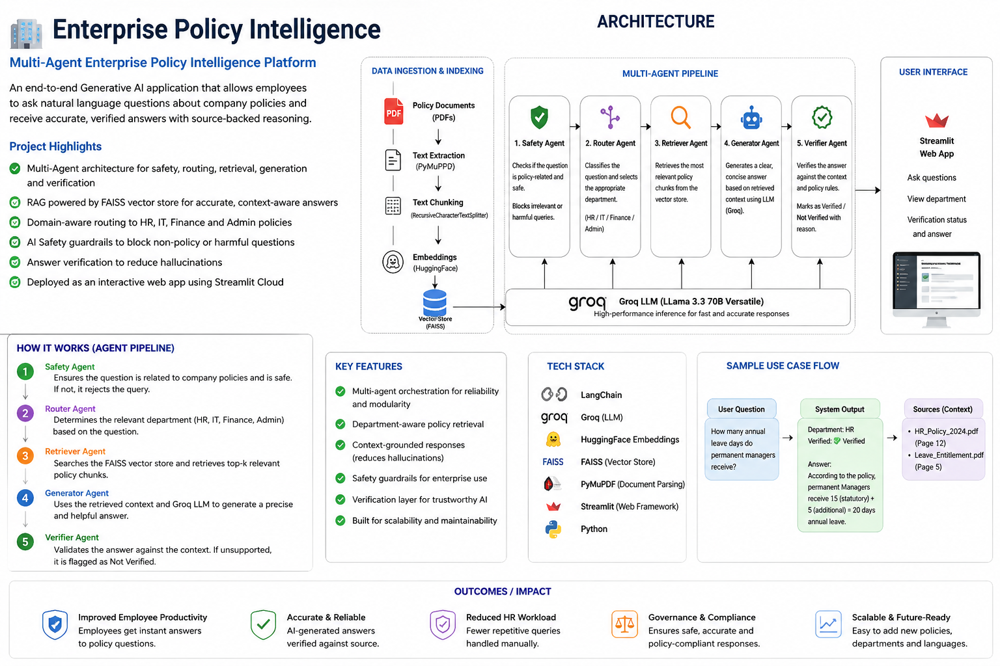

# Enterprise Policy Intelligence – Multi-Agent RAG System

Enterprise Policy Intelligence is an end-to-end Enterprise Generative AI application that answers employee policy questions using a Multi-Agent Retrieval-Augmented Generation (RAG) pipeline. The system leverages specialized AI agents for safety, routing, retrieval, response generation, and answer verification to provide reliable, context-grounded responses from enterprise policy documents.

---

## Features

- Multi-Agent AI Architecture
- Retrieval-Augmented Generation (RAG)
- Enterprise Policy Question Answering
- AI Safety & Governance
- Prompt Injection Detection
- Semantic Search using FAISS
- Answer Verification
- Streamlit Web Interface

---

## Architecture



---

## Multi-Agent Workflow

```
User Query
      │
      ▼
Safety Agent
      │
      ▼
Router Agent
      │
      ▼
Retriever Agent (FAISS)
      │
      ▼
Generator Agent (Groq Llama 3.3 70B)
      │
      ▼
Verifier Agent
      │
      ▼
Final Response
```

---

## Tech Stack

| Category | Technologies |
|----------|--------------|
| LLM | Groq Llama 3.3 70B |
| Framework | LangChain |
| Embeddings | BAAI/bge-small-en-v1.5 |
| Vector Database | FAISS |
| Frontend | Streamlit |
| PDF Processing | PyMuPDF |
| Language | Python |

---

## Project Structure

```
enterprise-policy-intelligence/
│
├── agents/
├── rag/
├── utils/
├── db/
├── policy_service.py
├── streamlit_app.py
├── config.py
├── requirements.txt
└── README.md
```

---

## Installation

```bash
git clone https://github.com/jitesh-sidhani/enterprise-policy-intelligence.git

cd enterprise-policy-intelligence

pip install -r requirements.txt

streamlit run streamlit_app.py
```

---

## Live Demo

👉 https://YOUR-STREAMLIT-LINK.streamlit.app

---

## Example Questions

- What is the annual leave policy?
- How many maternity leave days are allowed?
- What is the reimbursement policy?
- What is the password policy?
- What are the work-from-home guidelines?

